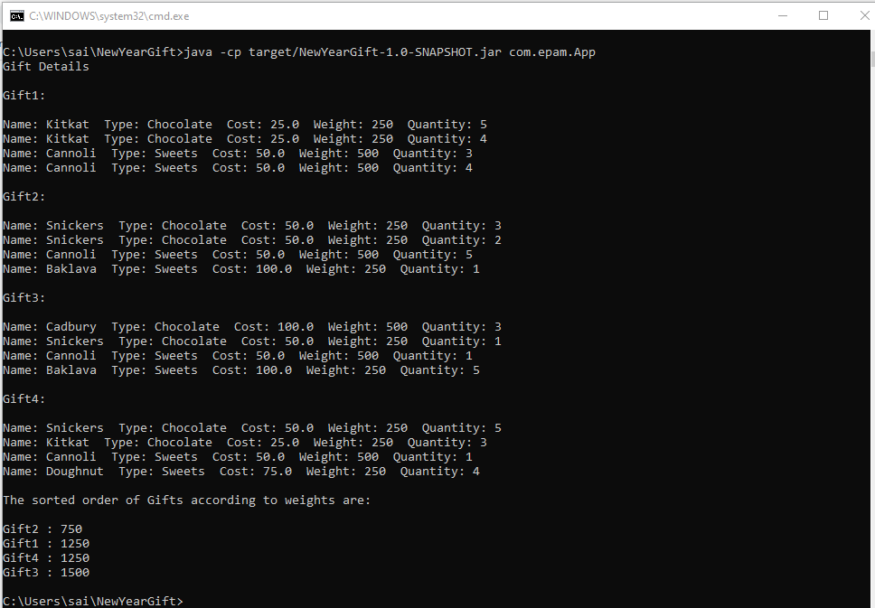

# MAVEN and OOP
#### Week2
## Maven:
Apache Maven is a **software project management and comprehension tool**. Based on the concept of a project object model (POM), Maven can manage a project's build, reporting and documentation from a central piece of information.

* ***Download Maven*** [Click Here](https://www-us.apache.org/dist/maven/maven-3/3.6.3/binaries/apache-maven-3.6.3-bin.zip)
* ***Install Maven*** Maven does not uses an executable file to install. Just unzip it to a folder.
* ***Maven Setup*** 
    1. Add evironment variable MAVEN_HOME to the path where you extracted the maven zip file.
    2. Add path variable, so that we can execute `mvn` command from any location in command prompt.
* ***Creating Maven Project***
    ```mvn archetype:generate -DgroupId=com.mycompany.app -DartifactId=my-app -DarchetypeArtifactId=maven-archetype-quickstart -DarchetypeVersion=1.4 -DinteractiveMode=false```
* ***Build the Project***
    1. `mvn package`
    2. `java -cp target/my-app-1.0-SNAPSHOT.jar com.mycompany.app.App`
---

# OOP:
The basic principles in *OOP* are:
* Abstraction
* Encapsulation
* Inheritance
* Polymorphism


## Task:
Create the below project using Maven.
> New Year's gift. Identify the hierarchy of chocolates and other sweets. Create multiple objects of sweets. Collect children's gift to define total weight. Sort the chocolates in a gift by one of the options. Find candies in the gift corresponding to a predetermined range of options. 

* The basic Classes I used to build this project are **App**, **NewYearGift**, **Candies**(Abstract class), **Chocolate**, **Sweets**.
* The methods are **preparegift**, **addChocolates** and **addSweets**.
* A random numbers of chocolates and sweets are added to the gift object, **ArrayList** is used to store the objects of chocolate and sweets classes.
* Based on the ***Weight*** of gift created the Gifts are sorted and displayed.

[]
